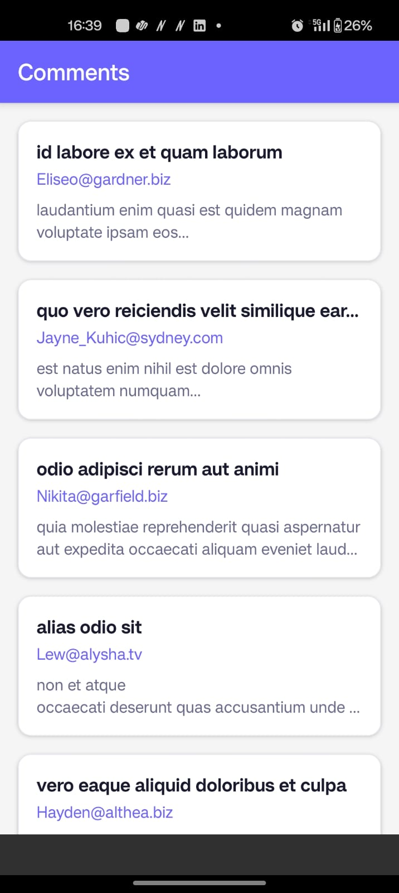
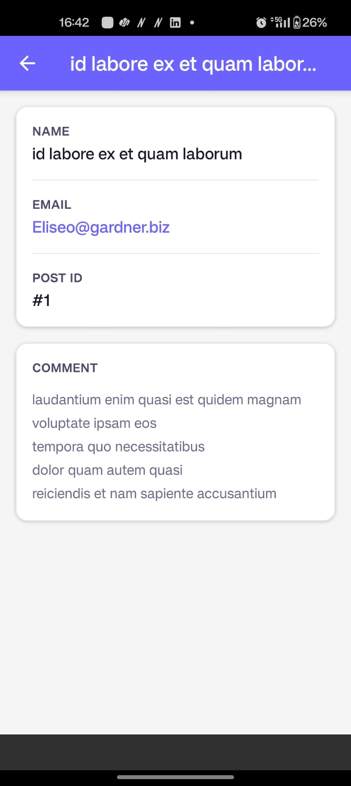
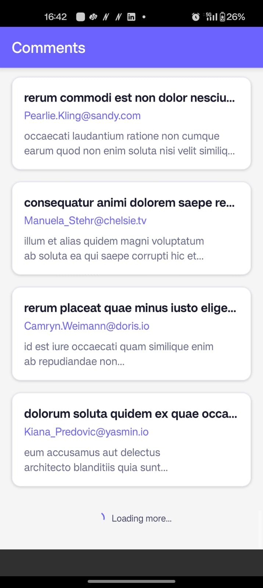
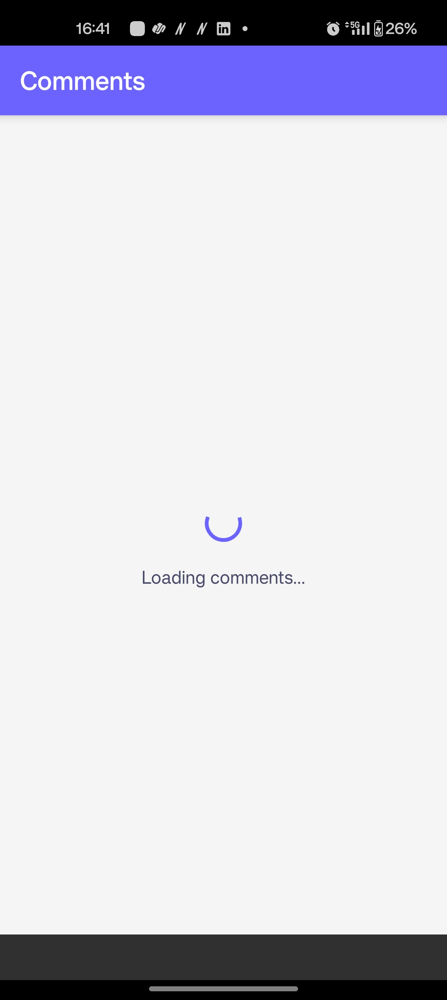

# CommentsApp 📱

A React Native CLI application built with TypeScript that fetches and displays paginated comments from the JSONPlaceholder API with smooth infinite scroll.

> 📸 Screenshots are available in the `/screenshots` folder of this repository.

---

## Screenshots

| List Screen | Detail Screen | Loading State | Pagination |
|-------------|---------------|---------------|------------|
|  |  |  |  |

---

## Tech Stack

| Technology | Purpose |
|------------|---------|
| React Native CLI 0.85 | Mobile framework |
| TypeScript | Type safety |
| React Navigation v7 (Native Stack) | Screen navigation |
| JSONPlaceholder API | Data source |
| React Hooks (useState, useEffect, useCallback) | State management |

---

## Features

- ✅ Paginated FlatList — loads 10 comments at a time
- ✅ Infinite scroll — automatically loads more on scroll
- ✅ Full-screen loader on first load
- ✅ Bottom spinner during pagination
- ✅ Error state with Retry button
- ✅ Comment detail screen via navigation params (no re-fetch)
- ✅ FlatList performance optimizations
- ✅ Reusable component architecture
- ✅ TypeScript throughout
- ✅ Centralized theme (colors, spacing, typography)

---

## Project Structure

```
CommentsApp/
├── src/
│   ├── api/
│   │   └── comments.ts              # API calls + Comment interface
│   ├── components/
│   │   ├── CommentCard.tsx          # Single list row component
│   │   ├── LoadingFooter.tsx        # Bottom pagination spinner
│   │   └── ErrorView.tsx           # Error state + retry button
│   ├── hooks/
│   │   └── useComments.ts          # All pagination logic
│   ├── navigation/
│   │   └── AppNavigator.tsx        # Native stack navigator
│   ├── screens/
│   │   ├── CommentsListScreen.tsx  # Screen 1 — paginated list
│   │   └── CommentDetailScreen.tsx # Screen 2 — full detail
│   └── theme/
│       └── index.ts                # Colors, spacing, typography
├── screenshots/                    # App screenshots
│   ├── ss_1_list.jpeg              # Comments list screen
│   ├── ss_2_detail.jpeg            # Comment detail screen
│   ├── ss_3_loading.jpeg           # Initial loading state
│   └── ss_4_pagination.jpeg        # Pagination loading state
├── App.tsx                         # Entry point
└── README.md
```

---

## Prerequisites

- Node.js 18+
- JDK 17 (Temurin recommended)
- Android Studio + Android SDK (API 34)
- Android Emulator or physical Android device

---

## Setup & Run

### 1. Clone the repo
```bash
git clone https://github.com/SaranyaSisodia/CommentsApp.git
cd CommentsApp
```

### 2. Install dependencies
```bash
npm install
```

### 3. Create local.properties
Create the file `android/local.properties` and add:
```
sdk.dir=C\:/Users/YOUR_USERNAME/AppData/Local/Android/Sdk
```

### 4. Set JAVA_HOME (Windows)
```powershell
$env:JAVA_HOME = "C:\Program Files\Eclipse Adoptium\jdk-17.x.x-hotspot"
$env:PATH = "$env:JAVA_HOME\bin;$env:PATH"
```

### 5. Start Metro bundler
```bash
npm start -- --reset-cache
```

### 6. Run on Android (new terminal)
```bash
npm run android
```

### 7. If using a physical device
```powershell
adb reverse tcp:8081 tcp:8081
```
Then launch manually if needed:
```powershell
adb shell am start -n com.commentsapp/com.commentsapp.MainActivity -a android.intent.action.MAIN -c android.intent.category.LAUNCHER
```

---

## Pagination Logic

```
App launches → loads page 1 (10 comments)
     ↓
User scrolls to 50% from bottom
     ↓
onEndReached fires → loads page 2 (10 more)
     ↓
Repeats until all 500 comments loaded
     ↓
hasMore = false → stops all further calls
```

**Guards that prevent duplicate API calls:**
- `isLoading` — blocks calls during first load
- `isLoadingMore` — blocks calls during pagination
- `hasMore` — stops calls when all data is loaded

---

## FlatList Optimizations

| Prop | Value | Purpose |
|------|-------|---------|
| `initialNumToRender` | 10 | Only render visible items on mount |
| `maxToRenderPerBatch` | 10 | Limit items rendered per scroll batch |
| `windowSize` | 5 | Keep 5 screen-heights of items in memory |
| `removeClippedSubviews` | true | Unmount off-screen items on Android |
| `keyExtractor` | `item.id` | Stable keys prevent unnecessary re-renders |
| `React.memo` | CommentCard | Skip re-render if props unchanged |
| `useCallback` | renderItem, keyExtractor | Stable function references for FlatList |

---

## Assumptions & Trade-offs

- **Android only** — iOS not configured
- **No local caching** — data re-fetches on every app restart
- **Full-screen error state** — error replaces entire screen rather than inline
- **No search/filter** — bonus feature not implemented due to time constraints
- **Params-based navigation** — detail screen gets full comment via navigation params, no re-fetch
- **500 total comments** — pagination stops automatically at page 50

---

## API Reference

```
Base URL: https://jsonplaceholder.typicode.com

GET /comments?_page={page}&_limit=10

Response shape:
{
  id: number,
  postId: number,
  name: string,
  email: string,
  body: string
}
```

---

*Built by Saranya Sisodia*
*GitHub: https://github.com/SaranyaSisodia/CommentsApp*